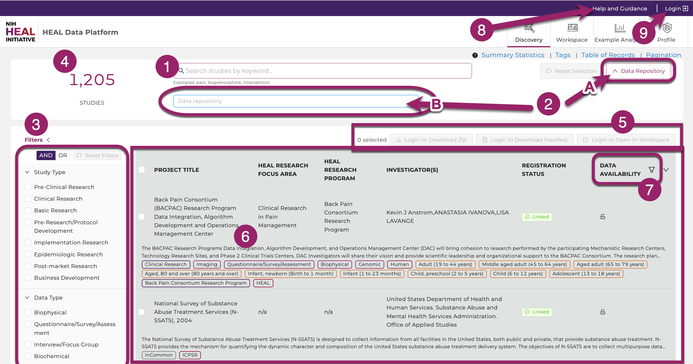
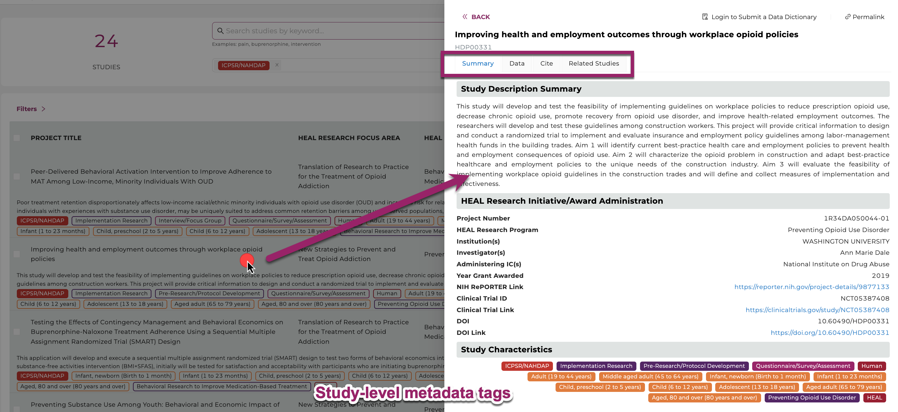
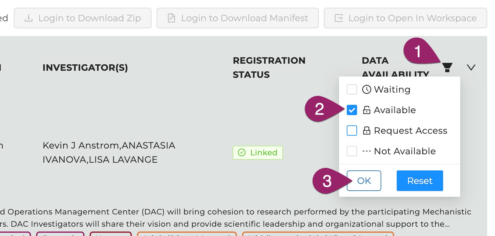
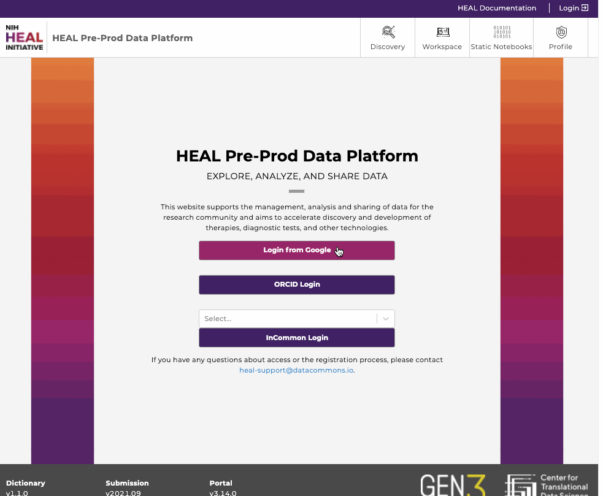

# Discovery Page

[The Discovery Page](https://healdata.org/portal/discovery) provides users a venue to search and find studies and datasets displayed in the HEAL Platform. Users can browse through the publicly accessible study-level metadata without requiring authorization.

> Use text-based search, faceted search, and tags to rapidly and efficiently find relevant studies, discover new datasets across multiple resources, and easily export selected data files to the analysis workspace.

The Discovery Page of the HEAL Platform. Browse through datasets and study-level metadata and find studies using tags or the free text search field.

## Search Features

<!-- MBK: deleted the "Click here: these sections shoudl probably
be embedded into the subsequent sections or have their own sections -->

Different features such as free text search bar and tags on the Discovery Page help navigating and refining the search.

1.  Free Text Search. Finding studies is made easy using keywords in the free text-based search bar or using tags. The free-text search bar can be used to search for study title, investigator name, or any keyword that is mentioned in the metadata of the study. Type in any keyword mentioned in the metadata, except for what is stored as Tags in "Study Characteristics".
2.  Study Characteristics. Click "Study Characteristics" to expand the search options. Find a range of tags in eight categories (Study Setting, Study Design, Pain, Data Type, Subject Characteristics, Intervention/Treatment, Substance Use, Data Resources) to narrow down any search. Selecting multiple tags work in a "OR" logic. Click on "Reset Selection" to start a new search.
3.  The total number of studies. Shows the amount of studies the HEAL Platform is currently displaying.
4.  Export Options. Login first to leverage the export options. Select one or multiple studies and 1) download the attached data files, 2) download a file manifest (for data files whose sizes exceed 250 MB), or 3) export the metadata and data files to a secure cloud environment "Workspaces" to start your custom data analysis in Python, R, or Stata.
5.  Studies. This feature presents all current studies on the HEAL Platform. Click on any study to show useful information about the study (metadata). 
6.  Data Availability. Filter on available, pending, and not-yet-available datasets.
7.  Documentation. This brings you to this page you are currently on.
8.  Login Page. Login on the HEAL Platform to leverage all features. [Read further here](logging-in.md).

## Find available Study-level Metadata

Finding available study-level metadata on the HEAL Platform is made easy by clicking on a study.

Clicking on any study will display the available study-level and dataset metadata.

## Find accessible Datasets

On the Discovery page, users can filter for studies that have data available through the platform using the Data Availability filter in the right-most column of the search results. Click on Data Availability (#1), then select only the Available box (#2) to find data that is available and that you have access to through the platform, then click OK (#3). The Discovery Page will automatically update the list of studies that have available datasets.  

The filter allows you to check more than one availability status, and uses an "OR" logic to filter studies. To interpret the different availability status options, please see the next section.

## Data Availability Options

{: style="height:250px"}

**Waiting:**  
“Waiting” is the default data availability status for studies added to the platform. This status means:  

* Data have not yet been submitted to a repository; or, 
* The repository has not yet released the data; or, 
* The study team has not yet provided the link to the data to the HEAL Data Platform. (To [submit a data link, see our documentation about this](reporting-repo.md/#get-the-permalink-to-your-study))

**Available:**
“Available” means you are now able to access these data via the HEAL Data Platform, by [downloading them](downloading_files.md/#download-data-files-from-the-discovery-page) and/or by [importing them in a workspace](workspaces/heal_workspaces.md)

**Request Access:**
“Request Access” means that the data has been deposited in a repository and is available. To access the data, you will first need to visit the host repository to request access to it, following the repository’s standard procedures. Once that is complete, authorized users can then [bring these data into a HEAL workspace for analysis](workspaces/heal_workspaces.md).

**Not Available:**
“Not Available” means that no data will be made available for this study.
 
## Select Files on the Discovery Page and bring them to the Workspace

The above gif shows the workflow used to select data files from the Discovery Page and bring them into the workspace using Jupyter Notebooks.  

1.  Log in at <https://healdata.org/portal/login>. Link your account to all FAIR repositories as described [here](platform_request_access.md#linking-access-to-fair-enabled-repositories).  
      
    
2.  Find and select the study by the project number (in this example: 1U2CDA050098-01\_a) on the [Discovery Page](https://healdata.org/portal/discovery). Find other current open-access studies [here](platform_request_access.md#current-open-access-studies).  
      
    
3.  Click the “Open in Workspace” button in the upper right corner. This step will create a manifest folder which you can find later in the Workspace’s folder "data/healdata.org".  
    
    
    Select the study and click on “Open in Workspace”.
    
      
      
    
4.  Choose a workspace flavor and click "Launch". This step may take several minutes.  
      
    
5.  Navigate to the `/pd/data/healdata.org/` folder and find the placeholder files there. Click on those placeholder files to find instructions how to download the files or see below.  
      
    
6.  From the directory `/pd`, users can now start a new notebook. Click “New” (upper right corner) or open a previously saved notebook on the landing drive to load the files into one of the cells, for example by running:

    > ! gen3 drs-pull object "guid"

    > import pandas as pd   

    > os.chdir('/pd')

    > demo_df = pd.read_csv('pd/demo_file.txt', sep='\t')

    > demo_df.head()

More information for instructions on importing data can be found in the sections ["Download Files to Workspaces"](downloading_files.md#download-data-files-in-workspaces-using-the-python-sdk) and ["Workspaces"](platform_workspaces.md).  
    
    
7.  Make sure to terminate the workspace when the work is finished to reduce computational costs.

- "pd" means persistent directory. Saved files outside this directory will be lost.  
- The manifest.json lists metadata of all exported files and can be used to download in [batches](downloading_files.md#download-data-files-in-workspaces-using-the-python-sdk)  
- Note, that all exported data files will be saved in the `/pd/data/healdata.org/` folder.  
- Please also note, that the workspace mounts up to a maximum of 5 different manifests while the workspace is running but shows only the latest exported manifest in a newly launched workspace.  
- Terminating the workspace will result in the loss of all but the latests manifest.  
