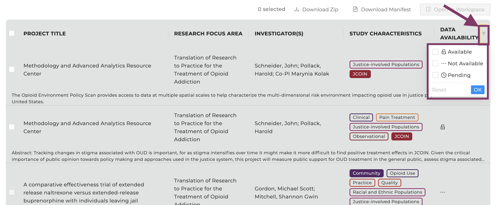
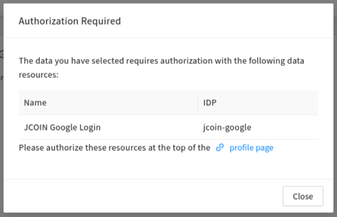

# Check and request access

Users can find out to which projects they have access to by navigating to [the Discovery Page](https://healdata.org/portal/discovery) and by selecting “Data Availability" - "Available" - ”OK” as shown below.

Available data can be found when the box next to "Available" is selected.

## Access to individual Studies

You can check access by clicking on a study in the Discovery Page, as shown below:

The Study Page will display access permissions in the top right corner. Click the “Permalink” button in the upper right to copy the link to the clipboard.

If you have access, a green box will show “You have access to this study”.

Access is displayed as a yellow box on top of each Study Page.

## Current (open-access) studies

Current open-access studies will be shown when navigating to the Discovery Page.  
Users can download and/or export open-access study files after logging in. Currently, the HEAL Platform hosts the following studies. All are open-access except when noted.

Note, that different studies relate to different [Data Resources](#DataManagementRepositories).

| Project   number | Study Name | Data Resource |
|---|---|---|
| 57b45d83d6c9e7e8693ccdfd | Naloxone Overdose Prevention Laws | PDAPS |
| 10.3886/ICPSR34945.v3 | National Mental Health Services   Survey (N-MHSS) | ICPSR |
| 1U24AR076730-01 | A synthetic dataset from the Back   Pain Consortium (BACPAC) Research Program Data Integration, Algorithm   Development and Operations Management Center | HEAL |
| 10.3886/ICPSR04256.v5 | National Survey of Substance Abuse   Treatment Services (N-SSATS) | ICPSR |
| cdcwonder | CDC Wide-ranging Online Data for   Epidemiologic Research (CDC WONDER) Mortality Multiple Cause-of-Death Public   Use Record | HEAL |
| 10.3886/ICPSR30122.v5 | Treatment Episode Data Set:   Discharges (TEDS-D) | ICPSR |
| deaarcos1 | Drug Enforcement Administration   Controlled Substances Tracking (DEA ARCOS) | HEAL |
| a)   1U2CDA050098-01_a | JCOIN - Methodology and Advanced   Analytics Resource Center: | JCOIN |
| b)   1U2CDA050098-01_b | a) JCOIN 026: Amerispeak Brief   Stigma Survey | JCOIN  |
|   | b) The Opioid Environment Policy   Scan |JCOIN  |

## Overview of access to Datasets and Studies

Users can visit the ["Profile” page](https://healdata.org/portal/identity) to view a list of studies they have access to under the “You have access to the following project(s)” section, as shown in the figure below.

A user can view their study access in the Profile Page.

From here users can also view current API keys or create and download new keys. API keys are required for downloads which require use of the Gen3-client. More information in the chapter [“Downloading Data Files”](#DownloadingDataFiles).

API keys can be viewed, created, and downloaded on the Profile Page.

From here users can also view if they have access to projects or workspaces

*   /dictionary\_page: You have access to the data dictionary.
*   /workspace: You have access to the workspace.
*   /programs/open: You have access to open-access projects.

## Linking access to FAIR enabled repositories

The HEAL Platform securely exposes data stored on multiple [HEAL-approved FAIR repositories](#DataManagementRepositories).

Users need to link their account to currently all FAIR repositories in order to:

1.  _run_ [Jupyter Notebooks](#StaticNoteboks) that utilize data stored on various FAIR repositories.
2.  _export_ data that is stored on FAIR repositories from the [Discovery Page to the Workspaces](#SelectBringFilesDiscoveryToWorkspace).
3.  _download_ data that is stored on FAIR repositories from the [Discovery Page](#DownloadFilesfromDiscovery).

In order to link the account to the involved FAIR repositories, navigate to the [Profile Page](https://healdata.org/portal/identity) and link the account to all current login options by clicking on the "Refresh \[..\] Google Login" buttons as shown below.

Linking access options on the Profile Page for data stored on FAIR enabled repositories.

Access needs to be renewed after 30 days, as indicated after "Status: expires in \[..\] days".

As a reminder, users will be prompted with a banner on [healdata.org/portal/workspace](https://healdata.org/portal/workspace) and a pop-up window on [healdata.org/portal/discovery](https://healdata.org/portal/discovery).

Users are reminded on [healdata.org/portal/workspace](https://healdata.org/portal/workspace) to link the account to all other FAIR enabled repositories on the Profile Page.

Users are reminded on [the Discovery Page](https://healdata.org/portal/discovery) to link the account to all other FAIR enabled repositories.
